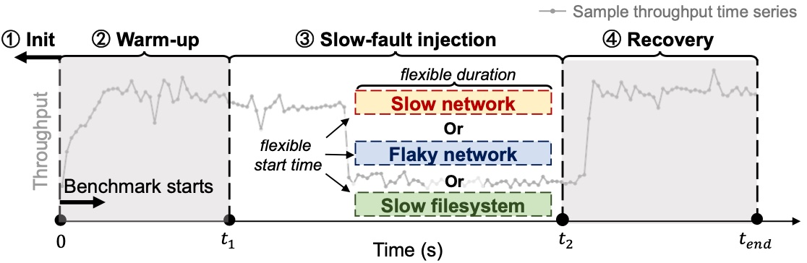

# Overview

This repo contains the source code of (1) Xinda, a slow-fault testing pipeline; and (2) ADR, a lightweight runtime slow-fault detection library. The following sections are for building and running Xinda. More information about ADR can be found [here](adr).

# Xinda



Xinda is designed to be a flexible and extensible slow-fault testing pipeline for distributed systems. It automates the process of initializing a distributed cluster, running cloud benchmarks, injecting flexible and fine-grained slow faults, collecting runtime logs and stats, and analyzing the results. It can be extended to support new distributed systems, benchmarks, and fault injection methods.

## Build

(**Recommended**) The easiest way to configure and deploy Xinda is to use [ansible-playbook](https://docs.ansible.com/ansible/latest/playbook_guide/playbooks_intro.html) on [CloudLab](https://www.cloudlab.us/) [c220g2](https://docs.cloudlab.us/hardware.html#%28part._cloudlab-wisconsin%29) nodes. A more detailed guideline is available [here](cloudlab-ansible/README.md).

<details>
<summary> To build and install Xinda manually </summary>

It is still recommended to go through each step of the [playbook](cloudlab-ansible/configure.yml). We highlight the following prerequisites:

* OS: Ubuntu 18.04
* Hardware: 
  - An SSD is required to mount the docker directory (`/var/lib/docker` by default).
  - As a reference, our evaluation runs on [CloudLab c220g2](https://docs.cloudlab.us/hardware.html#%28part._cloudlab-wisconsin%29) node type, which has two
  Intel E5-2660 v3 10-core CPUs at 2.60 GHz, 160GB ECC DDR4 2133 MHz memory, 
  and a 480GB Intel DC SATA SSD plus two 1.2TB 10K RPM 6G SAS HDDs for storage.
* Software:
  - [xinda-software](https://github.com/OrderLab/xinda-software/tree/master)
  - Python (==3.6.13). For data processing:
    - pandas (==2.2.2)
    - tqdm (==4.66.2)
  - [Blockade](https://github.com/worstcase/blockade) (==0.4.0, for injecting network-related slow faults)
  - [CharybdeFS](https://github.com/scylladb/charybdefs) for injecting filesystem-related slow faults:
    - [CMake](https://github.com/Kitware/CMake/releases/) (==3.23.0)
    - [Thrift](https://archive.apache.org/dist/thrift/0.10.0/) (==0.10.0)
    - [M4](https://ftp.gnu.org/gnu/m4) (==1.4.19)
    - [Autoconf](https://ftp.gnu.org/gnu/autoconf/) (==2.69)

</details>

## Getting started
Applying Xinda to a system involves two steps: (1) configuring Xinda arguments and running the test experiment using `main.py`; (2) analyzing the test results using `data-analysis/process.py`. We list the detailed steps of using Xinda [here](docs/getting-started.md).

## Examples

Let's start by running a sample Xinda test on HBase. More examples can be found in [`./examples`](examples). We will inject a 1ms network delay to the regionserver for 60s:
```bash
python3 main.py \
    --sys_name hbase \
    --log_root_dir $HOME/workdir/data/example \
    --data_dir sample_test \
    --fault_type nw \
    --fault_location hbase-regionserver \
    --fault_duration 60 \
    --fault_severity slow-1ms \
    --fault_start_time 60 \
    --bench_exec_time 150 \
    --ycsb_wkl mixed \
    --benchmark ycsb \
    --iter 1
```
Xinda will first start to set up an HBase cluster, wait till initialization finishes, and run the YCSB benchmark for 150s (`--bench_exec_time`). After 60s (`--fault_start_time`) of the benchmark, Xinda will inject the slow fault and then clear it after 60s (`--fault_duration`). After benchmark ends, Xinda will save system logs and runtime stats to $HOME/workdir/data/example/hbase/sample_test (`--log_root_dir` and `--data_dir`). Finally, Xinda will safely shutdown the cluster and do the cleanup.

Now, let's analyze the test results using `process.py`
```bash
python3 $HOME/workdir/xinda/data-analysis/process.py \
    --data_dir $HOME/workdir/data/example \
    --output_dir $HOME/workdir/parsed_results
```
The parsed results will be stored in `$HOME/workdir/parsed_results`.

## Contributing

Thank you for your interest in Xinda and ADR! We greatly value your feedback and contributions. If you would like to report a bug, suggest an enhancement, or ask any questions, please submit a [GitHub Issue](https://github.com/OrderLab/xinda/issues/new). For code contributions, feel free to open a [Pull Request](https://github.com/OrderLab/xinda/pulls). 

## Publication

If you find Xinda and ADR useful, please consider citing our paper:

```bibtex
@inproceedings{SlowFaultStudy2025NSDI,
  author = {Lu, Ruiming and Lu, Yunchi and Jiang, Yuxuan and Xue, Guangtao and Huang, Peng},
  title = {One-Size-Fits-None: Understanding and Enhancing Slow-Fault Tolerance in Modern Distributed Systems},
  booktitle = {Proceedings of the 22nd USENIX Symposium on Networked Systems Design and Implementation},
  series = {NSDI '25},
  month = {April},
  year = {2025},
  location = {Philadelphia, PA, USA},
}
```