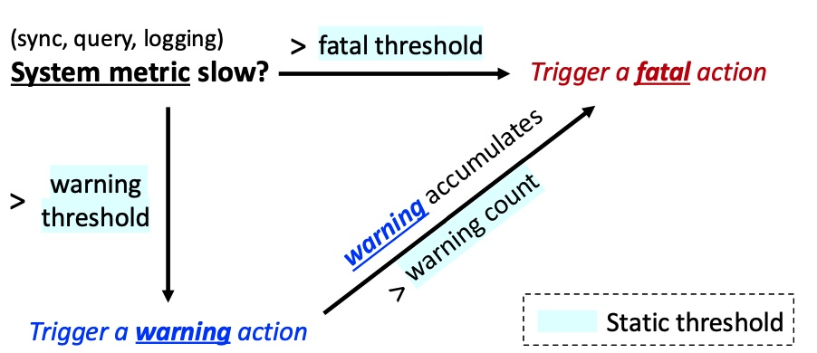
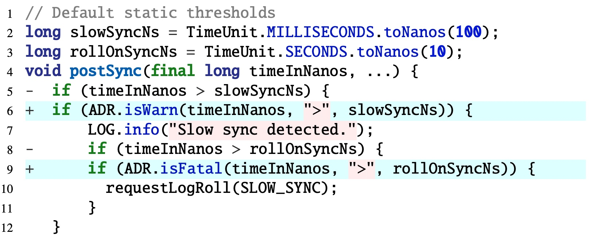

# Overview

This repo contains the source code of ADR, a lightweight adaptive fail-slow detection library for distributed systems. ADR can be used as a plug-in when adding fail-slow handling code. 

As shown below, developers usually define static and often over-conservative thresholds to detect slowness in some built-in variables (e.g., [hadoop](https://github.com/apache/hadoop/blob/release-3.3.6-RC0/hadoop-hdfs-project/hadoop-hdfs-client/src/main/java/org/apache/hadoop/hdfs/DataStreamer.java#L1138-L1149), [CASSANDRA-12403](https://issues.apache.org/jira/browse/CASSANDRA-12403), [CRDB](https://github.com/cockroachdb/cockroach/blob/v23.1.11/pkg/storage/pebble.go#L1246-L1275), [HBASE-22301](https://issues.apache.org/jira/browse/HBASE-22301)). ADR traces these system variables, automatically adapts the associated threshold variables to decide slowness, and invokes different levels of defined actions.

# Use Case

The above figure shows the use case of ADR in HBase. Originally, HBase already includes tracing code for the WAL sync. The latest sync time is stored in `timeInNanos` (a tracing variable). It further defines two static threshold variables, `slowSyncNs` (line 2) and `rollOnSyncNs` (line3), and uses two statements (lines 5 and 8) to check if the sync time exceeds the thresholds. Different actions would be taken accordingly, emitting a warning (line 7) or rolling WAL (line 10).

With ADR, the original parameters inside the ''if'' conditions are retained but wrapped up using ADR’s APIs. Specifically, we call `isWarn()` in line 6 to compare the latest sync time with an adaptive threshold. Then we use `isFatal()` in line 9 to check if there is a continuous slowdown and frequency change (or if the latest value exceeds the default threshold). If so, a log roll would be triggered per developers’ design.

