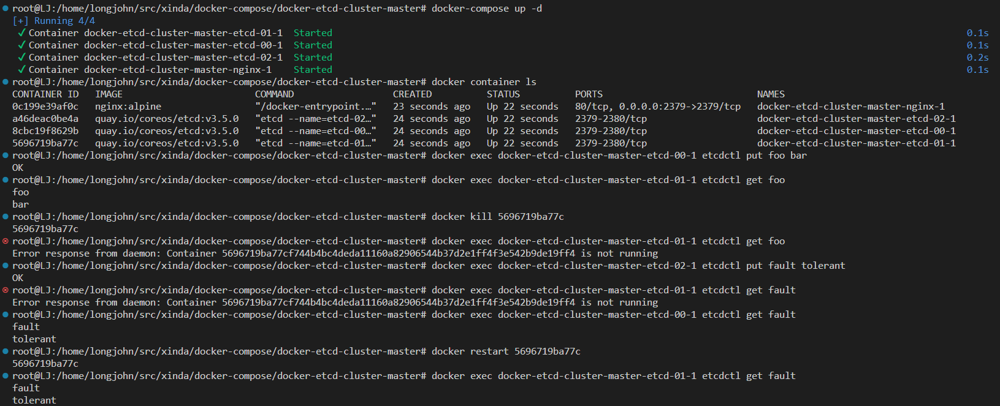
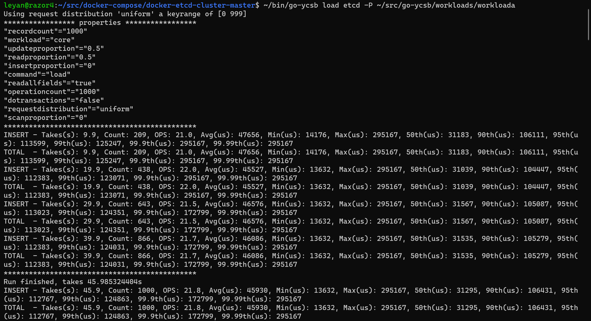
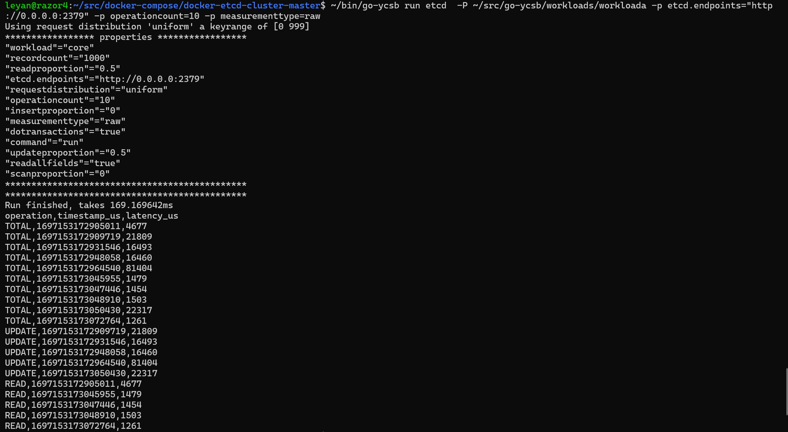

# etcd

## Start in docker

run a cluster:
```
docker-compose up -d
```

see container information:
```
docker container ls
```

put a key-value pair:
```
docker exec <docker-etcd-cluster container name> etcdctl put <key> <value>
```

get a key-value pair:
```
docker exec <docker-etcd-cluster container name> etcdctl get <key>
```

kill/restart a container:
```
docker kill <container ID>
docker restart <container ID>
```

shut down a cluster:
```
docker-compose down
```

Sample usage:


## Benchmark with go-ycsb

[ignore] get the go-ycsb binary:

```
# wget -c https://github.com/pingcap/go-ycsb/releases/latest/download/go-ycsb-linux-amd64.tar.gz -O - | tar -xf

# give it a try
./go-ycsb --help
```

[ignore] clone the whole repo(we need go-ycsb/workloads/workloada):

```
git clone git@github.com:pingcap/go-ycsb.git
```

go-ycsb load:
```
# <bin path>/go-ycsb load etcd -P <repo path>/go-ycsb/workloads/workloada
/data/ruiming/xinda/xinda-software/go-ycsb load etcd -P /data/ruiming/xinda/xinda-software/go-ycsb-source/workloads/workloada
```



go-ycsb run:
```
# <bin path>/go-ycsb run etcd -P <repo path>/go-ycsb/workloads/workloada -p etcd.endpoints="http://0.0.0.0:2379" -p operationcount=10 -p measurementtype=raw

/data/ruiming/xinda/xinda-software/go-ycsb run etcd -P /data/ruiming/xinda/xinda-software/go-ycsb-source/workloads/workloada -p etcd.endpoints="http://0.0.0.0:2379" -p operationcount=10 -p measurementtype=raw

# the differences from our previous usage are:
# 1. use "run etcd" instead of "run basic"
# 2. the values for "etcd.endpoints" are from "--listen-client-urls" in docker-compose.yml
```


