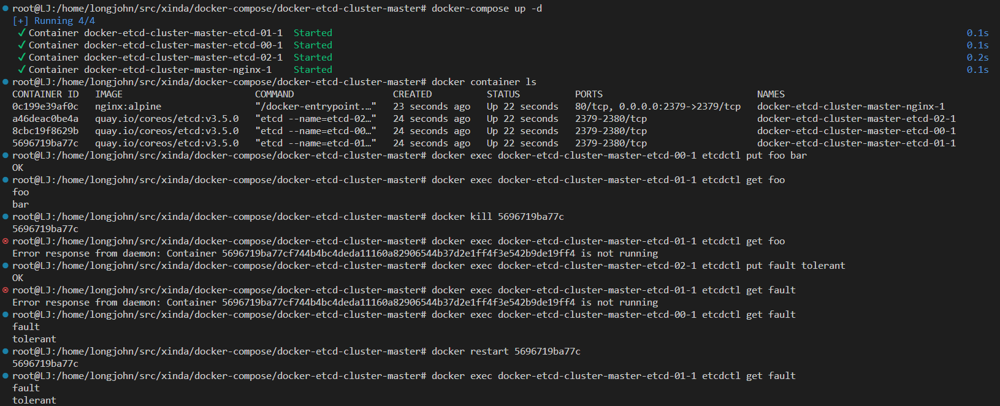
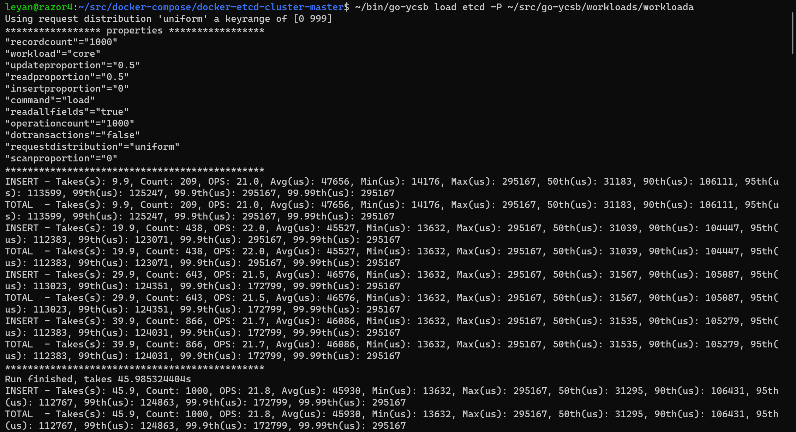
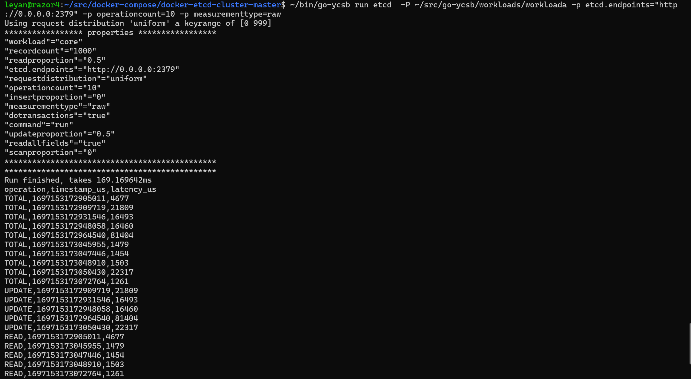

# Misc

* (2023-11-10) Add support to etcd-benchmarking tool. Running as a separate docker container. Links:
    * https://github.com/OrderLab/xinda-etcd-benchmark
    * https://hub.docker.com/r/rmlu/etcd-benchmark

# etcd-benchmark

!!IMPORTANT!! https://etcd.io/docs/v3.2/learning/api

## TL;DR
We choose the following benchmarks to test etcd:
| Benchmark | Description1 | Description2  | 
| --- | --- | --- |
| lease-keepalive | how quickly and reliably an etcd cluster can handle lease keepalive requests | Leases are a mechanism for detecting client liveness. The cluster grants leases with a time-to-live. A lease expires if the etcd cluster does not receive a keepAlive within a given TTL period. To tie leases into the key-value store, each key may be attached to at most one lease. When a lease expires or is revoked, all keys attached to that lease will be deleted. Each expired key generates a delete event in the event history. |
| range | how efficiently are keys fetched from the key-value store using the Range API call | |
| stm | Testing different isolation and locking mechaisms for transactions | Software Transactional Memory |
| txn-put | Testing atomic put |  |
| watch | Testing the performance of processing watch requests and sending events to watchers | The Watch API provides an event-based interface for asynchronously monitoring changes to keys. An etcd3 watch waits for changes to keys by continuously watching from a given revision, either current or historical, and streams key updates back to the client |
| watch-get | Testing performance of establishing new watches and catching up with the current state of the watched keys |  Benchmark for serialized key gets with many unsynced watchers |

## Exploring different benchmarks
```
$ docker exec -it etcd-benchmark benchmark -h
Available Commands:                                                                                                                [16/1914]
  help            Help about any command
  lease-keepalive Benchmark lease keepalive
  mvcc            Benchmark mvcc
  put             Benchmark put
  range           Benchmark range
  stm             Benchmark STM; 
  txn-put         Benchmark txn-put
  watch           Benchmark watch
  watch-get       Benchmark watch with get
  watch-latency   Benchmark watch latency
```
### lease-keepalive
> Leases are a mechanism for detecting client liveness. The cluster grants leases with a time-to-live. A lease expires if the etcd cluster does not receive a keepAlive within a given TTL period. To tie leases into the key-value store, each key may be attached to at most one lease. When a lease expires or is revoked, all keys attached to that lease will be deleted. Each expired key generates a delete event in the event history.
```
## The following command need ~2m30s to complete on cloudlab (without any slow faults)
docker exec -it etcd-benchmark benchmark lease-keepalive --endpoints=etcd0:2379,etcd2379,etcd2:2379 --total 800000
```

### mvcc
```
--batch-interval int   Interval of batching (milliseconds) (default 100)
--batch-limit int      A limit of batched transaction (default 10000)
docker exec -it etcd-benchmark benchmark mvcc put --endpoints=etcd0:2379,etcd1:2379,etcd2:2379
# {"level":"info","msg":"kvstore restored","current-rev":1}
# panic: runtime error: invalid memory address or nil pointer dereference
# [signal SIGSEGV: segmentation violation code=0x1 addr=0x0 pc=0x9736b3]
# Can only run without timeseries statistics when using rmlu/etcd-benchmark:nots
```

### put (similar to ycsb)
> Keys are saved into the key-value store by issuing a Put call
```
## The following command need ~2m30s to complete on cloudlab (without any slow faults)
docker exec -it etcd-benchmark benchmark put --endpoints=etcd0:2379,etcd1:2379,etcd2:2379 --total 13000 --conns 300
```
### range
> Keys are fetched from the key-value store using the Range API call
```
## The following command need ~2m30s to complete on cloudlab (without any slow faults)
docker exec -it etcd-benchmark benchmark range key --endpoints=etcd0:2379,etcd1:2379,etcd2:2379 --total 380000
```

### stm
`stm` stands for `Software Transactional Memory`. 
> --isolation string {Read Committed (c), Repeatable Reads (r), Serializable (s), or Snapshot (ss) (default "r")}.

Taken from gpt4 (need to double-check):
* Read Committed (c): This isolation level guarantees that any data read is committed at the moment it is read. Thus, it does not see uncommitted (or "dirty") data. However, it can still experience non-repeatable reads and phantom reads.
* Repeatable Reads (r): This isolation level ensures that if a transaction reads data a second time within the same transaction, it will find the same data, thus preventing non-repeatable reads. However, it can still experience phantom reads because it does not guarantee a snapshot of the data; other transactions could insert new rows that match a query condition.
* Serializable (s): This is the strictest isolation level, which ensures complete isolation from other transactions. It's as if transactions were processed serially rather than concurrently. This level prevents dirty reads, non-repeatable reads, and phantom reads. It can be more resource-intensive and can lead to increased contention.
* Snapshot (ss): This isolation level provides a snapshot of the database at a point in time. Each read within the transaction sees a consistent snapshot of the data as it existed at the start of the transaction or at the point of the first read. Other transactions' changes to the database that occur after the snapshot are not visible within the transaction.

> --stm-locker string    Wrap STM transaction with a custom locking mechanism (stm, lock-client, lock-rpc) (default "stm")

Taken from gpt4 (need to double-check):
* STM-Locker (optmistic):
    * This likely refers to using STM's own locking mechanisms to manage concurrency. STM in etcd is a software layer that allows for transactions to be composed of multiple operations that either all succeed or all fail.
    * An STM transaction ensures that all reads within the transaction see a consistent view of the data and that writes are applied atomically.
    * The STM locker would use optimistic concurrency control, where it assumes that multiple transactions can complete without affecting each other and checks for conflicts at the end of the transaction.
* Locker-Client (pessimistic):
    *  This might refer to explicit client-side locking using etcd's distributed locking API. The locking API provides a way to lock a key so that only one client can modify it at a time.
    * When using a locker-client, a client would first acquire a lock on a key before performing operations on it, and then release the lock once the operations are done.
    * This approach is more pessimistic, as it assumes conflicts are likely and prevents them by ensuring exclusive access to resources before performing any operations.
```
## The following command need ~2m30s to complete on cloudlab (without any slow faults)
docker exec -it etcd-benchmark benchmark stm --endpoints=etcd0:2379,etcd1:2379,etcd2:2379 --total 380000 --isolation r --stm-locker stm
docker exec -it etcd-benchmark benchmark stm --endpoints=etcd0:2379,etcd1:2379,etcd2:2379-total 130000 --isolation s --stm-locker stm
docker exec -it etcd-benchmark benchmark stm --endpoints=etcd0:2379,etcd1:2379,etcd2:2379-total 400000 --isolation c --stm-locker stm
docker exec -it etcd-benchmark benchmark stm --endpoints=etcd0:2379,etcd1:2379,etcd2:2379-total 130000 --isolation ss --stm-locker stm

docker exec -it etcd-benchmark benchmark stm --endpoints=etcd0:2379,etcd1:2379,etcd2:2379 --total 6000 --isolation r --stm-locker lock-client
docker exec -it etcd-benchmark benchmark stm --endpoints=etcd0:2379,etcd1:2379,etcd2:2379 --total 6000 --isolation s --stm-locker lock-client
docker exec -it etcd-benchmark benchmark stm --endpoints=etcd0:2379,etcd1:2379,etcd2:2379 --total 6000 --isolation c --stm-locker lock-client
docker exec -it etcd-benchmark benchmark stm --endpoints=etcd0:2379,etcd1:2379,etcd2:2379 --total 6000 --isolation ss --stm-locker lock-client
```

### txn-put
Address the transactional (atomic) put
```
## The following command need ~2m30s to complete on cloudlab (without any slow faults)
docker exec -it etcd-benchmark benchmark txn-put --endpoints=etcd0:2379,etcd1:2379,etcd2:79 --total 13000 --txn-ops 1
```

### watch
> The Watch API provides an event-based interface for asynchronously monitoring changes to keys. An etcd3 watch waits for changes to keys by continuously watching from a given revision, either current or historical, and streams key updates back to the client.
> Benchmark watch tests the performance of processing watch requests and sending events to watchers. It tests the sending performance by changing the value of the watched keys with concurrent put requests. During the test, each watcher watches (--total/--watchers) keys (a watcher might watch on the same key multiple times if --watched-key-total is small). Each key is watched by (--total/--watched-key-total) watchers.
```
## The following command need ~2m30s to complete on cloudlab (without any slow faults)
## docker exec -it etcd-benchmark benchmark watch --endpoints=etcd0:2379,etcd1:2379,etcd2:23 --put-total 12000
```

###  watch-get
> Benchmark for serialized key gets with many unsynced watchers
```
## The following command need ~2m30s to complete on cloudlab (without any slow faults)
## docker exec -it etcd-benchmark benchmark watch-get --endpoints=etcd0:2379,etcd1:2379,etcd2:2379 --watchers 1000000
```

### watch vs. watch-get
Taken from gpt4 (need to double-check):
> The watch benchmark is about the change notification performance, while the watch-get benchmark is about the performance of establishing new watches and catching up with the current state of the watched keys. Both are important for understanding the performance characteristics of etcd under different real-world usage scenarios.

# Instructions (by Leyan)

## Start in docker

run a cluster:
```
docker-compose up -d
```

see container information:
```
docker container ls
```

put a key-value pair:
```
docker exec <docker-etcd-cluster container name> etcdctl put <key> <value>
```

get a key-value pair:
```
docker exec <docker-etcd-cluster container name> etcdctl get <key>
```

kill/restart a container:
```
docker kill <container ID>
docker restart <container ID>
```

shut down a cluster:
```
docker-compose down
```

Sample usage:


## Benchmark with go-ycsb

[ignore] get the go-ycsb binary:

```
# wget -c https://github.com/pingcap/go-ycsb/releases/latest/download/go-ycsb-linux-amd64.tar.gz -O - | tar -xf

# give it a try
./go-ycsb --help
```

[ignore] clone the whole repo(we need go-ycsb/workloads/workloada):

```
git clone git@github.com:pingcap/go-ycsb.git
```

go-ycsb load:
```
# <bin path>/go-ycsb load etcd -P <repo path>/go-ycsb/workloads/workloada
/data/ruiming/xinda/xinda-software/go-ycsb load etcd -P /data/ruiming/xinda/xinda-software/go-ycsb-source/workloads/workloada
```



go-ycsb run:
```
# <bin path>/go-ycsb run etcd -P <repo path>/go-ycsb/workloads/workloada -p etcd.endpoints="http://0.0.0.0:2379" -p operationcount=10 -p measurementtype=raw

/data/ruiming/xinda/xinda-software/go-ycsb run etcd -P /data/ruiming/xinda/xinda-software/go-ycsb-source/workloads/workloada -p etcd.endpoints="http://0.0.0.0:2379" -p operationcount=10000 --interval 1

# the differences from our previous usage are:
# 1. use "run etcd" instead of "run basic"
# 2. the values for "etcd.endpoints" are from "--listen-client-urls" in docker-compose.yml
```


